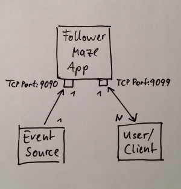

# Coding challenge Follower Maze

The [instructions.md](instructions.md) contains all the details for the task.

My solution implements a client server app.



## Prerequisites

The implementation was done using SCALA with the following tools:

| Tools | Version |
|---|---|
| Scala | 2.12 |
| IntelliJ | Community Edition 2018.3.1 |

Run the Scala Build Tools to execute individual tasks:

```
build
```

to create an executable JAR file.

```
test
```

to run the implemented unit tests.

Run 

```
run
```

or

```
java -jar .\target\scala-2.12\follower-maze-scala_2.12-0.1.jar
```

to run the application.

The implementation was made on a Windows 10 notebook and I tested it on an EC2 AWS instance running Linux.
